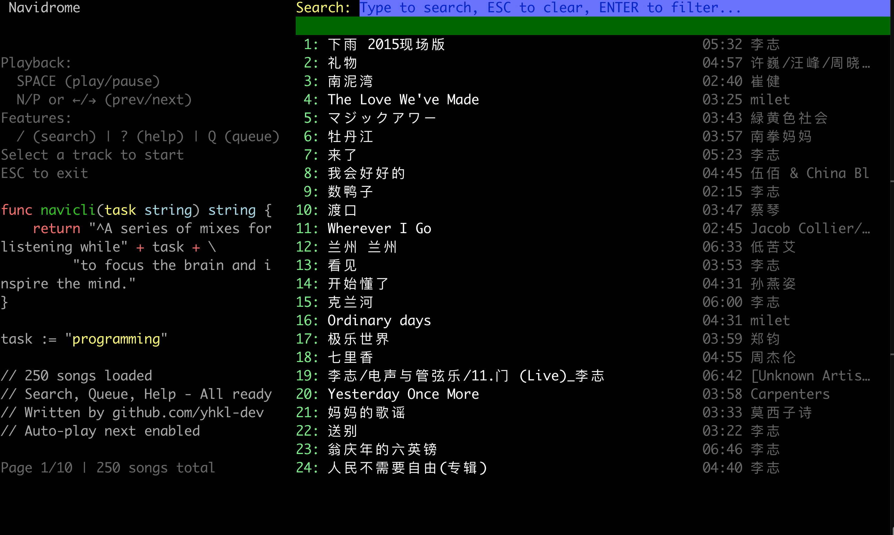
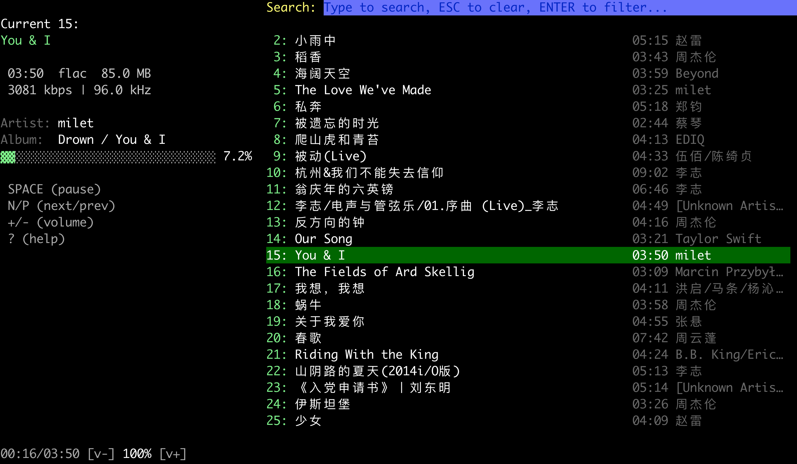

# NaviCLI 🎵
[](https://golang.org/)
[](https://github.com/yhkl-dev/NaviCLI/releases)
[](LICENSE)

A lightweight command line music player for Navidrome, written in Go.



## Background
> I found that Feishin client is very slow on MacOS.
> To be honest, we don't need a GUI for listening to music.
> So I built this app to play Navidrome music from terminal.
> Hope you guys like it.

## Features

- 🚀 Fast and lightweight
- 🎨 Terminal-based UI with colors and progress display
- ⏯ Play/pause/skip controls with real-time progress
- 🔍 Integrated search functionality
- 🔊 Volume control
- 📊 Song information display (artist, album, bitrate, format, etc.)
- ⌨️ Intuitive keyboard shortcuts
- 📝 Pagination support (multiple pages of songs)
- 🛠 Written in pure Go

## Installation

### Prerequisites
```bash
brew install mpv
```

### Install via Homebrew (Recommended)
```bash
# Add the tap
brew tap yhkl-dev/navicli

# Install navicli
brew install navicli

# Verify installation
navicli --help
```

To update NaviCLI in the future:
```bash
brew upgrade navicli
```

To uninstall:
```bash
brew uninstall navicli
brew untap yhkl-dev/navicli
```

### Install from Release
Download the latest pre-built binary from [Releases](https://github.com/yhkl-dev/NaviCLI/releases):

```bash
# For Apple Silicon (M1/M2/M3):
curl -L https://github.com/yhkl-dev/NaviCLI/releases/latest/download/release.tar.gz -o release.tar.gz
tar xzf release.tar.gz
chmod +x navicli-darwin-arm64
sudo mv navicli-darwin-arm64 /usr/local/bin/navicli
```

### Install from Source (Go 1.16+ required)
```bash
git clone https://github.com/yhkl-dev/NaviCLI.git
cd NaviCLI
go build -o navicli .
sudo mv navicli /usr/local/bin/
```

### Install for Linux(Debian/Ubuntu)
```bash
sudo apt install libgl1-mesa-dev libglu1-mesa-dev freeglut3-dev libmpv-dev mpv

git clone https://github.com/yhkl-dev/NaviCLI.git
cd NaviCLI
go build -o navicli .
sudo mv navicli /usr/local/bin/
```

### Configuration
Create a config file at `~/.config/config.toml`:
```toml
[server]
url = "https://your-navidrome-server.com"
username = "your-username"
password = "your-password"
```

## Usage
```bash
navicli
```

### Keyboard Shortcuts

**Playback Controls:**
- `Space`: Play/Pause
- `n` or `N`: Next track
- `p` or `P`: Previous track
- `→`: Next track (alternative)
- `←`: Previous track (alternative)
- `+` or `=`: Volume up (+5%)
- `-` or `_`: Volume down (-5%)

**Navigation:**
- `↑` / `↓`: Select song in list
- `<` or `>`: Previous/Next page
- `[` or `]`: Previous/Next page (alternative)
- `PgUp`/`PgDn`: Previous/Next page (alternative)
- `/`: Open search
- `?`: Show help panel
- `q` or `Q`: Show playback queue
- `ESC`: Close search/modal or quit (when not in search mode)
- `Ctrl+C`: Force quit

### Search

1. Press `/` to open the search box at the top
2. Type keywords to search
3. Press `Enter` to execute search
4. Results display in the main list
5. Use `↑↓` keys to select and `Enter` to play
6. Press `ESC` to clear search and restore original list
7. Press `Tab` or `↓` to switch focus from search box to list

### Display Information

When playing a song, you can see:
- Song title and play status (playing/paused)
- Technical info: Duration, Format, File size
- Quality info: Bitrate, Sample rate
- Metadata: Artist, Album, Track number
- Real-time progress bar with current time and total duration
- Current volume level

## Development
```bash
# Build
go build -o navicli .

# Run tests
go test ./...
```

## Roadmap
- [ ] Publish to Homebrew
- [ ] Add lyrics support
- [ ] Add playlist support
- [ ] Add favorites/bookmarking
- [ ] Add shuffle/repeat modes
- [ ] Cross-platform builds (Linux/Windows)

## Contributing
PRs are welcome! Please open an issue first to discuss what you'd like to change.

## License
[MIT](LICENSE)
