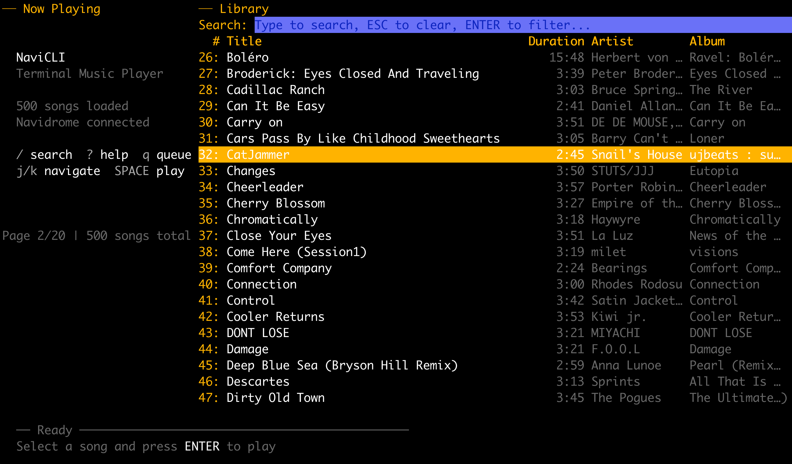
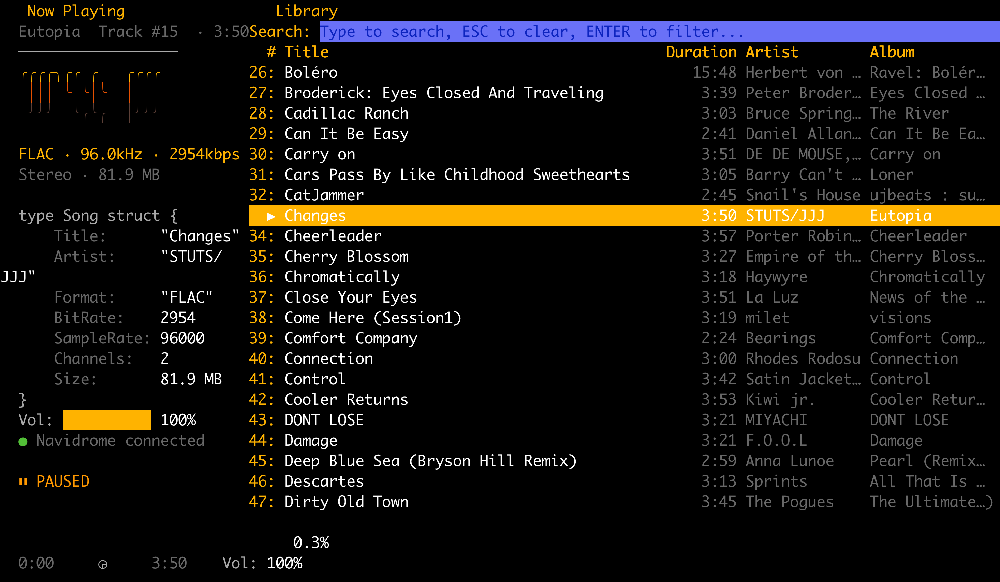

# NaviCLI 🎵
[](https://golang.org/)
[](https://github.com/yhkl-dev/NaviCLI/releases)
[](LICENSE)

A lightweight command line music player for Navidrome, written in Go.



## Background
> I found that Feishin client is very slow on MacOS.
> To be honest, we don't need a GUI for listening to music.
> So I built this app to play Navidrome music from terminal.
> Hope you guys like it.

## Features

- 🚀 Fast and lightweight
- 🎨 Redesigned terminal UI with Amber theme, braille progress bar, and panel layouts
- ⏯ Play/pause/skip controls with real-time progress and spinner animation
- 🔍 Integrated search with in-place results
- 🔊 Volume control with visual bar
- 📊 Now Playing panel: artist, album, track info, audio specs, oscilloscope
- 🎛 Sort modes: Random / Title / Artist / Album (`s` key)
- 📀 Dual song source: Random shuffle or Albums A-Z (`S` key)
- 🟢 Live connection status indicator
- ⌨️ Vim-style keyboard shortcuts (`j/k`, `gg/G`, `h/l`)
- 📝 Pagination with dynamic column widths
- 🛠 Written in pure Go

## Installation

### Prerequisites
```bash
brew install mpv
```

### Install via Homebrew (Recommended)
```bash
# Add the tap
brew tap yhkl-dev/navicli

# Install navicli
brew install navicli

# Verify installation
navicli --help
```

To update NaviCLI in the future:
```bash
brew upgrade navicli
```

To uninstall:
```bash
brew uninstall navicli
brew untap yhkl-dev/navicli
```

### Install from Release
Download the latest pre-built binary from [Releases](https://github.com/yhkl-dev/NaviCLI/releases):

```bash
# For Apple Silicon (M1/M2/M3):
curl -L https://github.com/yhkl-dev/NaviCLI/releases/latest/download/release.tar.gz -o release.tar.gz
tar xzf release.tar.gz
chmod +x navicli-darwin-arm64
sudo mv navicli-darwin-arm64 /usr/local/bin/navicli
```

### Install from Source (Go 1.16+ required)
```bash
git clone https://github.com/yhkl-dev/NaviCLI.git
cd NaviCLI
go build -o navicli .
sudo mv navicli /usr/local/bin/
```

### Install for Linux(Debian/Ubuntu)
```bash
sudo apt install libgl1-mesa-dev libglu1-mesa-dev freeglut3-dev libmpv-dev mpv

git clone https://github.com/yhkl-dev/NaviCLI.git
cd NaviCLI
go build -o navicli .
sudo mv navicli /usr/local/bin/
```

### Configuration
Create a config file at `~/.config/config.toml`:
```toml
[server]
url = "https://your-navidrome-server.com"
username = "your-username"
password = "your-password"
```

## Usage
```bash
navicli
```

### Keyboard Shortcuts

**Playback Controls:**
- `Space`: Play/Pause
- `n` / `N` / `l`: Next track
- `p` / `P` / `h`: Previous track
- `→`: Next track (arrow)
- `←`: Previous track (arrow)
- `+` / `=`: Volume up (+5%)
- `-` / `_`: Volume down (-5%)

**Navigation (Vim-style):**
- `j` / `↓`: Move down in list
- `k` / `↑`: Move up in list
- `J` / `PgDn`: Next page
- `K` / `PgUp`: Previous page
- `>` / `]`: Next page (alternative)
- `<` / `[`: Previous page (alternative)
- `gg`: Go to first page
- `G`: Go to last page

**Sort & Source:**
- `s`: Cycle sort mode (Random / Title / Artist / Album)
- `S`: Cycle song source (Random / Albums A-Z)

**Search & Info:**
- `/`: Open search
- `?`: Show help panel
- `q` / `Q`: Show playback queue
- `ESC`: Close modal or exit (when not in search mode)
- `Ctrl+C`: Force quit

### Search

1. Press `/` to open the search box at the top
2. Type keywords to search
3. Press `Enter` to execute search
4. Results display in the main list
5. Use `↑↓` keys to select and `Enter` to play
6. Press `ESC` to clear search and restore original list
7. Press `Tab` or `↓` to switch focus from search box to list

### Display Information

When playing, the Now Playing panel shows:
- Spinning animation indicator + song title
- Artist, album, track number, duration
- Dynamic separator line (adapts to panel width)
- Volume bar with visual fill indicator
- Connection status dot (green = connected)
- Playing/paused status

When paused, additional geek details appear:
- ASCII oscilloscope waveform visualization
- Audio specs (format, sample rate, bitrate, channels, file size)
- Go struct debug output (technical metadata)

The bottom bar shows a braille-pattern progress bar with 8x resolution, current/total time, and volume.

## Development
```bash
# Build
go build -o navicli .

# Run tests
go test ./...
```

## Roadmap
- [ ] Publish to Homebrew
- [ ] Add lyrics support
- [ ] Add playlist support
- [ ] Add favorites/bookmarking
- [ ] Add shuffle/repeat modes
- [ ] Cross-platform builds (Linux/Windows)

## Contributing
PRs are welcome! Please open an issue first to discuss what you'd like to change.

## License
[MIT](LICENSE)
